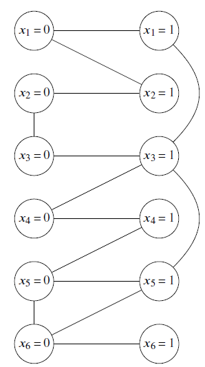
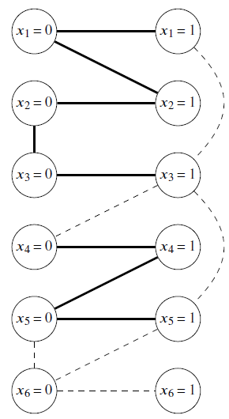
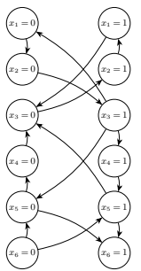

# Polytime Procedures for Conflict Inequalities, Elimination, and Fixing

This repository contains the code and experimental pipeline for the paper
**"Polytime Procedures for Conflict Inequalities, Elimination, and Fixing"** by
Thiago Barbosa and Hamidreza Validi.

The implementation identifies **hopscotch paths** in conflict structures of MIP
formulations with binary variables. These paths support polynomial-time
procedures for:

- adding conflict inequalities;
- eliminating redundant variables, both directly and indirectly;
- fixing binary variables to zero or one.

## Repository Layout

| Path | Purpose |
| --- | --- |
| `scc_approach_w_config.py` | Recommended end-to-end implication-graph/SCC batch pipeline. |
| `config.json` | Batch configuration: instance path, category, and enabled reductions. |
| `GetInstances.py` | Downloads MIPLIB instances listed in `problems_list/`. |
| `problems_list/` | Text files defining the MIPLIB instance sets used by the experiments. |
| `main.py` | Conflict-graph implementation using the CBC-backed `mip` package. |
| `main_gurobi.py` | Gurobi conflict-graph implementation. |
| `implication_graph.py` | Supporting implication-graph routines. |
| `readme_images/` | Figures used in this README. |

## Approaches

| Approach | Implementation | Paper section | Use case |
| --- | --- | --- | --- |
| Conflict graph + hopscotch paths | `main.py`, `main_gurobi.py` | Section 4 | Baseline and reproducibility. |
| Implication graph + SCC condensation | `scc_approach_w_config.py` | Section 5 | Recommended batch pipeline. |

The SCC pipeline is the preferred entry point. It builds an implication graph,
compresses strongly connected components, computes elimination/fixing
reductions, and solves baseline and preprocessed models with Gurobi.

## Requirements

- Python 3.11
- Gurobi 12.0 or newer, with a valid license, for `scc_approach_w_config.py` and
  `main_gurobi.py`
- Python packages listed in `requirements.txt`

Install dependencies from the repository root:

```bash
python -m pip install -r requirements.txt
```

Optional, if you use a conda environment and want NetworkX METIS support:

```bash
conda install -c conda-forge networkx-metis
```

## Running the Full Pipeline

Run these commands from the repository root.

### 1. Install Dependencies

```bash
python -m pip install -r requirements.txt
```

### 2. Download the MIPLIB Instances

The default `config.json` expects `.mps` files under `problems/`, grouped into
subdirectories such as `problems/easy_problems/` and `problems/hard_problems/`.
Those files are downloaded by:

```bash
python GetInstances.py
```

This script reads `problems_list/binary.txt` and the category lists in
`problems_list/`, downloads the corresponding compressed MIPLIB instances, and
extracts them into the `problems/` directory.

### 3. Review or Edit `config.json`

Each entry in `config.json` has this structure:

```json
{
  "air03": {
    "filepath": "problems/easy_problems/air03.mps",
    "category": "easy",
    "fixing": false,
    "elimination": true
  }
}
```

Use `fixing` and `elimination` to enable or disable each reduction family for an
instance. The command-line flags below can also disable reductions globally.

### 4. Run the Recommended SCC Batch Pipeline

```bash
python scc_approach_w_config.py --config_path config.json
```

Useful options:

```bash
python scc_approach_w_config.py --config_path config.json --tag trial1
python scc_approach_w_config.py --config_path config.json --seeds 0
python scc_approach_w_config.py --config_path config.json --seeds 0,1,2,3,4 --time_limit 3600
python scc_approach_w_config.py --config_path config.json --no_elim
python scc_approach_w_config.py --config_path config.json --no_fix
python scc_approach_w_config.py --config_path config.json --max_vars 1000000 --timeout_prep 1800
```

By default, the SCC pipeline runs seeds `0,1,2,3,4`, uses a 3600-second Gurobi
time limit per solve, and writes results to:

```text
results_YYYY-MM-DD[_tag]/batch_results.csv
results_YYYY-MM-DD[_tag]/logs/
```

For each configured instance, the pipeline:

1. loads the MPS model;
2. builds the implication graph;
3. computes SCCs and the condensation graph;
4. identifies direct/indirect eliminations and variable fixings;
5. solves the baseline model and applicable preprocessed variants;
6. appends all timing, reduction, and solver statistics to `batch_results.csv`.

The solver configurations written to the CSV are:

- `Baseline`
- `Elimination_Only`
- `Fixing_Only`
- `All_Preprocessing`

Only configurations with available reductions are solved.

## Legacy Pipelines

The original conflict-graph implementation can be run with:

```bash
python main.py config.json
```

The Gurobi version of the original conflict-graph implementation can be run with:

```bash
python main_gurobi.py config.json
```

Useful options for `main_gurobi.py`:

```bash
python main_gurobi.py config.json --tag trial1
python main_gurobi.py config.json --max_vars 15000
python main_gurobi.py config.json --no_elim
python main_gurobi.py config.json --no_fix
```

## Outputs

The recommended SCC pipeline creates one dated results directory per run. The
main output is `batch_results.csv`, with columns for:

- instance metadata: `run_id`, `category`, `problem`, `n`, `m`;
- preprocessing statistics: SCC count, build time, elimination time, fixing time;
- reduction counts: direct elimination, indirect elimination, fixing to 0, fixing
  to 1;
- solver statistics: configuration, seed, status, solve time, nodes, objective
  value, and objective bound.

Gurobi logs are stored in the run's `logs/` subdirectory.

## Figures

Conflict graph | Hopscotch paths
:---:|:---:
 | 

Implication graph |
:---:


## Citation

If you use this code, please cite the paper:

```bibtex
@article{barbosa_validi_polytime,
  title = {Polytime Procedures for Conflict Inequalities, Elimination, and Fixing},
  author = {Barbosa, Thiago and Validi, Hamidreza},
  journal = {INFORMS Journal on Computing}
}
```
